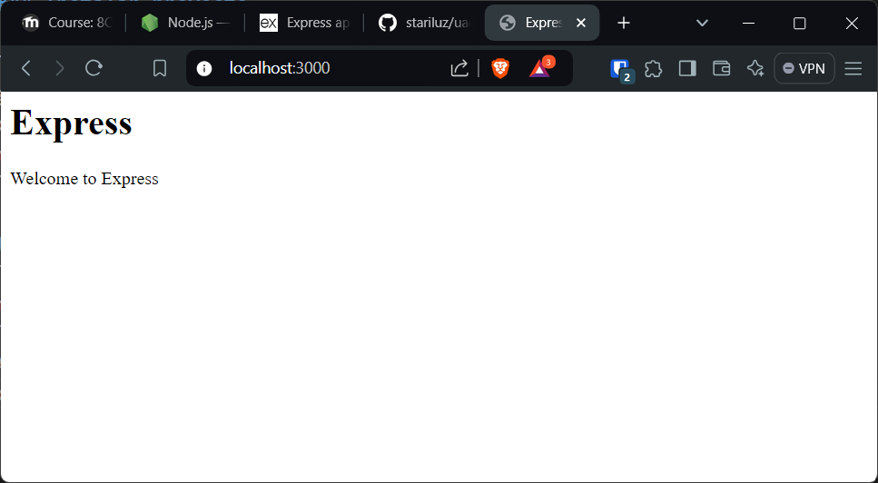

# Servidor Backend para el sistema en linea de checklists compartidas

### Instalar proyecto

```sh
git clone git@github.com:stariluz/uach-wp-videoclub-api-express.git
cd uach-wp-videoclub-api-express
npm install
```

### Ejecutar proyecto
```sh
npm run start
```
Ahora abre el navegador en `http://localhost:3000/`. Deberás ver la siguiente pantalla
