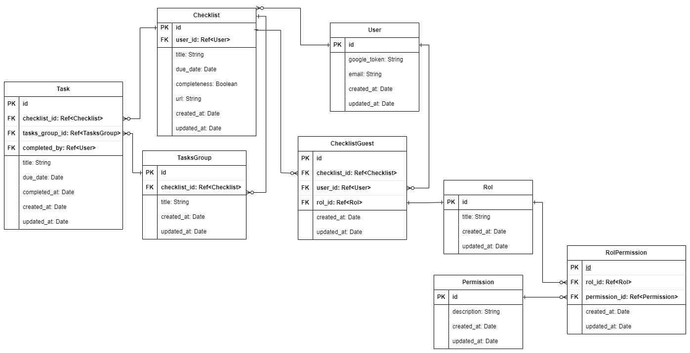

# Servidor Backend para el sistema en linea de checklists compartidas

### Instalar proyecto

```sh
git clone git@github.com:stariluz/uach-wp-videoclub-api-express.git
cd uach-wp-videoclub-api-express
npm install
```

### Ejecutar proyecto
```sh
npm run start
```
Ahora abre el navegador en `http://localhost:3000/`. Deberás ver la siguiente pantalla


### Diseño de la base de datos


### Diseño de la api

#### Endpoints de autenticación

| Route           | Method | Body                                             | Code | Response                       |
| --------------- | ------ | ------------------------------------------------ | ---- | ------------------------------ |
| `/auth/log-in`  | POST   | `google-authorization:String`                    | 200  | jwttoken {data:userSanitizied} |
| `/auth/log-out` | POST   |                                                  | 200  |                                |
| `/auth/sign-up` | POST   | `email:String`<br/>`google-authorization:String` | 200  | jwttoken {data:userSanitizied} |

#### Endpoints de modelos

Todas las peticiones a los endpoints de modelo deberán contener en el
encabezado el token de autenticación.

| Routes for models                            |
| -------------------------------------------- |
| [`/users`              ](#users            ) |
| [`/checklists`         ](#checklists       ) |
| [`/tasks`              ](#tasks            ) |
| [`/tasks-groups`       ](#tasks-groups     ) |
| [`/checklists-guests`  ](#checklists-guests) |
| [`/roles`              ](#roles            ) |
| [`/permissions`        ](#permissions      ) |
| [`/rol-permissions`    ](#rol-permissions  ) |

##### /users

| Route                  | Method | Params        | Body                                             | Response                |
| ---------------------- | ------ | ------------- | ------------------------------------------------ | ----------------------- |
| `/create`              | POST   |               | `email:String`<br/>`google-authorization:String` | `user:User`             |
| `/:user_id`            | GET    | `user_id:int` |                                                  | `user:User`             |
| `/:user_id/list`       | GET    |               |                                                  | `users:User[]`          |
| `/:user_id/delete`     | DELETE | `user_id:int` | `email:String`                                   | `user:User`             |
| `/:user_id/checklists` | GET    | `user_id:int` |                                                  | `checklists:Checklists` |

##### /checklists

| Route                         | Method | Params             | Body                                                                             | Response                       |
| ----------------------------- | ------ | ------------------ | -------------------------------------------------------------------------------- | ------------------------------ |
| `/create`                     | POST   |                    | `user_id:int`<br/>`title:String`<br/>`due_date?:Date`<br/>`completeness:boolean` | `checklist:Checklist`          |
| `/:checklist_id`              | GET    | `checklist_id:int` |                                                                                  | `checklist:ChecklistPopulated` |
| `/list`                       | GET    |                    |                                                                                  | `checklists:Checklist[]`       |
| `/:checklist_id/update`       | PATCH  | `checklist_id:int` | `title:String`<br/>`due_date?:Date`<br/>`completeness:boolean`                   | `checklist:Checklist`          |
| `/:checklist_id/replace`      | PUT    | `checklist_id:int` | `title:String`<br/>`due_date?:Date`<br/>`completeness:boolean`                   | `checklist:Checklist`          |
| `/:checklist_id/delete`       | DELETE | `checklist_id:int` |                                                                                  | `checklist:Checklist`          |
| `/:checklist_id/tasks`        | GET    | `checklist_id:int` |                                                                                  | `tasks:Task[]`                 |
| `/:checklist_id/tasks-groups` | GET    | `checklist_id:int` |                                                                                  | `tasks:Task[]`                 |

##### /tasks

| Route               | Method | Params        | Body                                                                                                     | Response       |
| ------------------- | ------ | ------------- | -------------------------------------------------------------------------------------------------------- | -------------- |
| `/create`           | POST   |               | `checklist_id:int`<br/>`task_group_id:int`<br/>`title:int`<br/>`due_date:Date`                           | `task:Task`    |
| `/:task_id`         | GET    | `task_id:int` |                                                                                                          | `task:Task`    |
| `/list`             | GET    |               |                                                                                                          | `tasks:Task[]` |
| `/:task_id/update`  | PATCH  | `task_id:int` | `task_group_id:int`<br/>`title:int`<br/>`due_date:Date`<br/>`completed_at?:Date`<br/>`completed_by?:int` | `task:Task`    |
| `/:task_id/replace` | PUT    | `task_id:int` | `task_group_id:int`<br/>`title:int`<br/>`due_date:Date`<br/>`completed_at?:Date`<br/>`completed_by?:int` | `task:Task`    |
| `/:task_id/delete`  | DELETE | `task_id:int` |                                                                                                          | `task:Task`    |

##### /tasks-groups

| Route                      | Method | Params               | Body                                  | Response                            |
| -------------------------- | ------ | -------------------- | ------------------------------------- | ----------------------------------- |
| `/create`                  | POST   |                      | `checklist_id:int`<br/>`title:string` | `tasks_group:TaskGroup`             |
| `/:tasks_group_id`         | GET    | `tasks_group_id:int` |                                       | `tasks_group:TaskGroupPopulated`    |
| `/list`                    | GET    |                      |                                       | `tasks_groups:TaskGroupPopulated[]` |
| `/:tasks_group_id/update`  | PATCH  | `tasks_group_id:int` | `checklist_id:int`<br/>`title:string` | `tasks_group:TaskGroup`             |
| `/:tasks_group_id/replace` | PUT    | `tasks_group_id:int` | `checklist_id:int`<br/>`title:string` | `tasks_group:TaskGroup`             |
| `/:tasks_group_id/delete`  | DELETE | `tasks_group_id:int` |                                       | `tasks_group:TaskGroup`             |
| `/:tasks_group_id/tasks`   | GET    | `tasks_group_id:int` |                                       | `tasks:Task[]`                      |

##### /checklists-guests

| Route                          | Method | Params                   | Body                                                   | Response                                     |
| ------------------------------ | ------ | ------------------------ | ------------------------------------------------------ | -------------------------------------------- |
| `/create`                      | POST   |                          | `checklist_id:int`<br/>`user_id: int`<br/>`rol_id:int` | `checklist_guest:ChecklistGuest`             |
| `/:checklist_guest_id`         | GET    | `checklist_guest_id:int` |                                                        | `checklist_guest:ChecklistGuestPopulated`    |
| `/list`                        | GET    |                          |                                                        | `checklist_guests:ChecklistGuestPopulated[]` |
| `/:checklist_guest_id/update`  | PATCH  | `checklist_guest_id:int` | `checklist_id:int`<br/>`user_id: int`<br/>`rol_id:int` | `checklist_guest:ChecklistGuest`             |
| `/:checklist_guest_id/replace` | PUT    | `checklist_guest_id:int` | `checklist_id:int`<br/>`user_id: int`<br/>`rol_id:int` | `checklist_guest:ChecklistGuest`             |
| `/:checklist_guest_id/delete`  | DELETE | `checklist_guest_id:int` |                                                        | `checklist_guest:ChecklistGuest`             |
| `/:checklist_guest_id/users`   | GET    | `checklist_guest_id:int` |                                                        | `users:User[]`                               |

##### /roles

| Route                  | Method | Params       | Body           | Response                    |
| ---------------------- | ------ | ------------ | -------------- | --------------------------- |
| `/create`              | POST   |              | `title:string` | `rol:Rol`                   |
| `/:rol_id`             | GET    | `rol_id:int` |                | `rol:RolPopulated`          |
| `/list`                | GET    |              |                | `roles:RolPopulated[]`      |
| `/:rol_id/update`      | PATCH  | `rol_id:int` | `title:string` | `rol:Rol`                   |
| `/:rol_id/replace`     | PUT    | `rol_id:int` | `title:string` | `rol:Rol`                   |
| `/:rol_id/delete`      | DELETE | `rol_id:int` |                | `rol:Rol`                   |
| `/:rol_id/permissions` | GET    | `rol_id:int` |                | `permissions:Permissions[]` |

##### /permissions

| Route                     | Method | Params              | Body                | Response                  |
| ------------------------- | ------ | ------------------- | ------------------- | ------------------------- |
| `/create`                 | POST   |                     | `desciption:string` | `permission:Permision`    |
| `/:permission_id`         | GET    | `permission_id:int` |                     | `permission:Permision`    |
| `/list`                   | GET    |                     |                     | `permissions:Permision[]` |
| `/:permission_id/update`  | PATCH  | `permission_id:int` | `desciption:string` | `permission:Permision`    |
| `/:permission_id/replace` | PUT    | `permission_id:int` | `desciption:string` | `permission:Permision`    |
| `/:permission_id/delete`  | DELETE | `permission_id:int` |                     | `permission:Permision`    |

##### /rol-permissions

| Route                        | Method | Params                  | Body                                 | Response                                |
| ---------------------------- | ------ | ----------------------- | ------------------------------------ | --------------------------------------- |
| `/create`                    | POST   |                         | `rol_id:int`<br/>`permission_id:int` | `rol_permission:RolPermission`          |
| `/:rol_permission_id`        | GET    | `rol_permission_id:int` |                                      | `rol_permission:RolPermissionPopulated` |
| `/list`                      | GET    |                         |                                      | `roles_permissions:RolPermission[]`     |
| `/:rol_permission_id/delete` | DELETE | `rol_permission_id:int` |                                      | `rol_permission:RolPermission`          |
